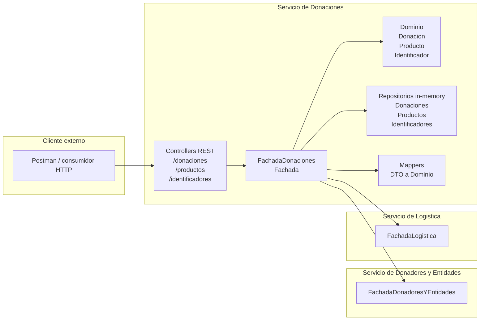
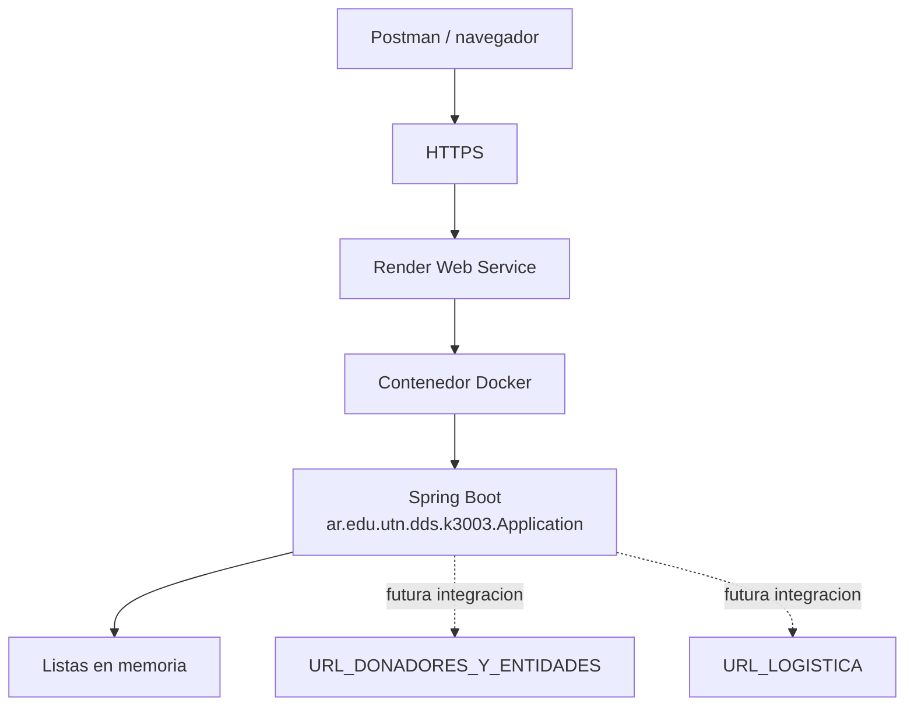

# Arquitectura - Servicio de Donaciones

## Componentes

El componente desarrollado es el Servicio de Donaciones. Expone una API HTTP y concentra
la orquestacion en `Fachada`, respetando la idea de controllers como capa de presentacion
y fachada como capa de servicio.

## Despliegue actual

En esta entrega no hay persistencia externa. La aplicacion se ejecuta como un servicio
Spring Boot y mantiene los datos en memoria, igual que en la entrega anterior.

## Notas de integracion

- Para esta entrega se agregaron adaptadores locales de Donadores y Logistica que permiten
  ejecutar el flujo basico sin tener los otros servicios desplegados.
- La integracion real entre componentes queda preparada por las interfaces de catedra:
  `FachadaDonadoresYEntidades` y `FachadaLogistica`.
- Los datos se guardan en memoria; no hay base de datos ni ORM en esta entrega.
