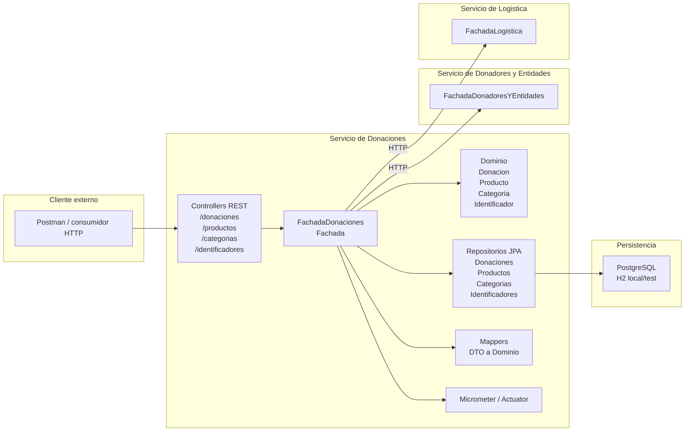
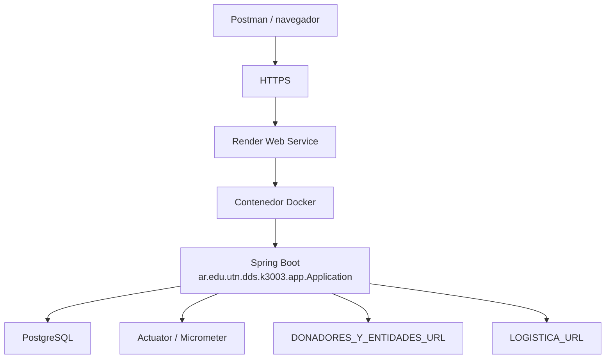

# Arquitectura - Servicio de Donaciones

## Componentes

El componente desarrollado es el Servicio de Donaciones. Expone una API HTTP y concentra
la orquestacion en `Fachada`, respetando la idea de controllers como capa de presentacion
y fachada como capa de servicio.

## Despliegue actual

La aplicacion se ejecuta como un servicio Spring Boot. En despliegue productivo se configura
con PostgreSQL mediante variables de entorno de Spring (`SPRING_DATASOURCE_URL`,
`SPRING_DATASOURCE_USERNAME`, `SPRING_DATASOURCE_PASSWORD`). Para ejecucion local sin
configuracion externa conserva H2 en memoria como fallback.

## Notas de integracion

- La integracion con Donadores y Entidades se configura con `DONADORES_Y_ENTIDADES_URL`.
  El servicio consume `GET /donadores/{id}`, `GET /donadores/{id}/puede-donar` y
  `POST /donadores/{id}/quejas`.
- La integracion con Logistica se configura con `LOGISTICA_URL`. El servicio consume
  `POST /depositos/{id}/donacion` para informar la donacion ingresada.
- Si las URLs externas no estan configuradas, se usan adaptadores locales solo para facilitar
  desarrollo aislado.
- Se exponen metricas de altas y errores de integracion mediante Actuator/Micrometer.
- Las categorias se cargan previamente por `/categorias` y se validan antes de crear productos.
