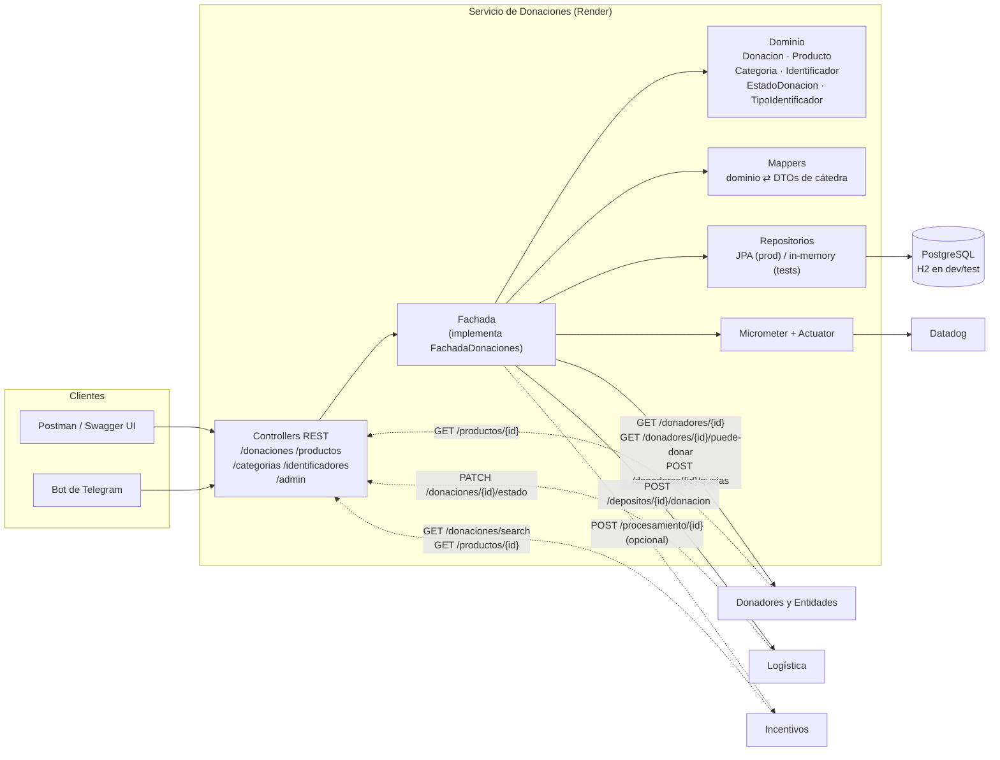
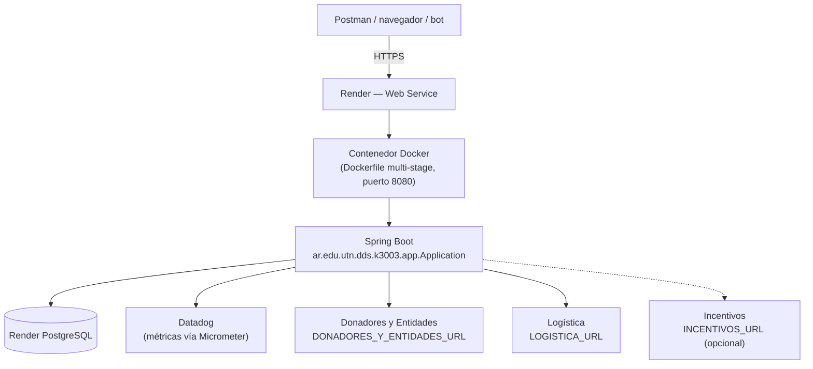

# Arquitectura - Servicio de Donaciones

## Componentes

El componente expone una API HTTP y concentra la orquestación en `Fachada`: los controllers son la
capa de presentación y la fachada la capa de servicio. El dominio no conoce ni a Spring ni a los
DTOs de la cátedra.


```mermaid
flowchart LR
  subgraph Clientes["Clientes"]
    Postman["Postman / Swagger UI"]
    Bot["Bot de Telegram"]
  end

  subgraph Donaciones["Servicio de Donaciones (Render)"]
    Controllers["Controllers REST<br>/donaciones /productos<br>/categorias /identificadores<br>/admin"]
    Fachada["Fachada<br>(implementa FachadaDonaciones)"]
    Dominio["Dominio<br>Donacion · Producto<br>Categoria · Identificador<br>EstadoDonacion · TipoIdentificador"]
    Mappers["Mappers<br>dominio ⇄ DTOs de cátedra"]
    Repos["Repositorios<br>JPA (prod) / in-memory (tests)"]
    Metrics["Micrometer + Actuator"]
  end

  DB[("PostgreSQL<br>H2 en dev/test")]
  DD["Datadog"]

  DYE["Donadores y Entidades"]
  LOG["Logística"]
  INC["Incentivos"]

  Postman --> Controllers
  Bot --> Controllers
  Controllers --> Fachada
  Fachada --> Dominio
  Fachada --> Mappers
  Fachada --> Repos
  Fachada --> Metrics
  Repos --> DB
  Metrics --> DD

  Fachada -->|"GET /donadores/{id}<br>GET /donadores/{id}/puede-donar<br>POST /donadores/{id}/quejas"| DYE
  Fachada -->|"POST /depositos/{id}/donacion"| LOG
  Fachada -.->|"POST /procesamiento/{id}<br>(opcional)"| INC

  LOG -.->|"PATCH /donaciones/{id}/estado"| Controllers
  INC -.->|"GET /donaciones/search<br>GET /productos/{id}"| Controllers
  DYE -.->|"GET /productos/{id}"| Controllers
```

Las flechas punteadas son las llamadas **entrantes**: Logística cambia el estado de la donación al
reportar la entrega, Incentivos consulta el historial del donador para evaluar misiones, y
Donadores y Entidades valida el producto al registrar una necesidad (Entrega 4).

## Despliegue


```mermaid
flowchart TB
  User["Postman / navegador / bot"] -->|HTTPS| Render["Render — Web Service"]
  Render --> Container["Contenedor Docker<br>(Dockerfile multi-stage, puerto 8080)"]
  Container --> App["Spring Boot<br>ar.edu.utn.dds.k3003.app.Application"]
  App --> DB[("Render PostgreSQL")]
  App --> DD["Datadog<br>(métricas vía Micrometer)"]
  App --> DYE["Donadores y Entidades<br>DONADORES_Y_ENTIDADES_URL"]
  App --> LOG["Logística<br>LOGISTICA_URL"]
  App -.-> INC["Incentivos<br>INCENTIVOS_URL (opcional)"]
```

## Configuración

Todo se configura por variables de entorno. **Las URLs de Donadores y Entidades y de Logística son
obligatorias**: si falta alguna, la aplicación no arranca (ver más abajo).

| Variable | Obligatoria | Descripción |
|---|---|---|
| `SPRING_DATASOURCE_URL` | sí en prod | JDBC de PostgreSQL. Sin ella cae a H2 en memoria. |
| `SPRING_DATASOURCE_USERNAME` | sí en prod | Usuario de la base. |
| `SPRING_DATASOURCE_PASSWORD` | sí en prod | Password de la base. |
| `DONADORES_Y_ENTIDADES_URL` | **sí** | Base URL del componente de Donadores y Entidades. |
| `LOGISTICA_URL` | **sí** | Base URL del componente de Logística. |
| `INCENTIVOS_URL` | no | Base URL de Incentivos. **Opcional**, ver abajo. |
| `PORT` | no | Puerto del servidor. Default `8080`. |
| `DATADOG_ENABLED` | no | Activa el export de métricas. Default `false`. |
| `DATADOG_API_KEY` | si `DATADOG_ENABLED=true` | API key de Datadog. |
| `DATADOG_URI` | no | Endpoint de Datadog. Default `https://api.us5.datadoghq.com`. |
| `DD_ENV` | no | Tag de ambiente en las métricas. Default `prod`. |
| `JPA_SHOW_SQL` | no | Loguea el SQL. Default `false`. |

### Por qué `INCENTIVOS_URL` es opcional

El enunciado define dos interacciones salientes para este componente: hacia **Donadores y
Entidades** (verificar el donador, consultar si puede donar, registrar la queja) y hacia
**Logística** (guardar la donación en el depósito). No define una interacción
`Donaciones → Incentivos`.

Avisarle a Incentivos cuando se registra una queja es un agregado propio, para que la pérdida de
progreso de una misión se note en el momento en vez de esperar a que corra su cron-job, que es el
mecanismo que la Entrega 4 sí define. Sin esa variable el flujo funciona igual y la aplicación
arranca sin problemas.

### Por qué la aplicación no arranca sin las otras dos URLs

Si falta la de Donadores y Entidades o la de Logística, el módulo instalaría una fachada local de
prueba cuyo `buscarDonadorPorID` **fabrica un donador para cualquier ID** y cuyo `puedeDonar`
devuelve siempre `true`. Eso convierte un error de configuración en "el módulo no valida nada", en
silencio, y es indistinguible de no haber implementado la validación.

Por eso, fuera de los perfiles `dev` y `test`, la ausencia de una de esas dos **aborta el arranque**
con un mensaje explícito. Para levantar local sin los otros componentes:

```bash
SPRING_PROFILES_ACTIVE=dev mvn spring-boot:run
```

El perfil `dev` habilita las fachadas locales, H2 en memoria y la consola H2. `GET /admin/estado`
informa en todo momento qué modo quedó activo para cada integración.

## Observabilidad

- **Contadores**: donaciones registradas, aceptadas, rechazadas; productos, categorías e
  identificadores registrados y eliminados; quejas; errores de integración por componente.
- **Timers**: `donatrack.donaciones.integracion.duracion`, etiquetado por `componente`,
  `operacion` y `resultado` (`ok` / `not_found` / `error`). Sirve para distinguir "el vecino está
  caído" de "el vecino está lento", que con los cold starts de Render pasa seguido.
- Expuestas en `/actuator/metrics` y `/actuator/prometheus`, y exportadas a Datadog.

> `management.endpoints.web.exposure.include` está restringido a `health,info,metrics,prometheus`.
> Con `*` quedaban públicos `/actuator/env` — que filtra el connection string de la base y la API
> key de Datadog — y `/actuator/heapdump`, sin autenticación.
