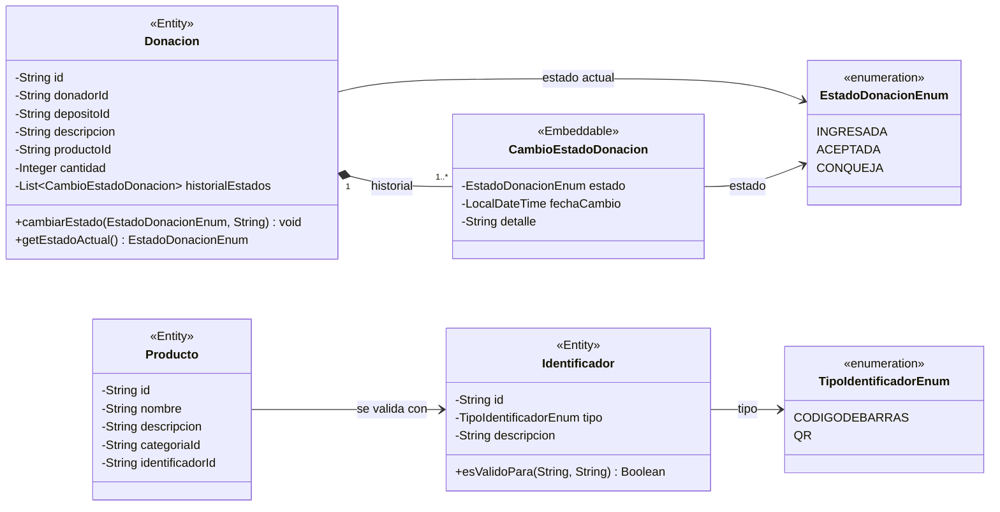

# Diagrama de clases - Servicio de Donaciones

El diagrama muestra las clases del dominio implementadas para el componente de Donaciones.
Los DTOs de catedra no se modelan como dominio: se usan como estructuras de intercambio en la
fachada y en la API.

## Reglas principales

- Una donacion se registra inicialmente en estado `INGRESADA`.
- Una donacion solo puede pasar de `INGRESADA` a `ACEPTADA`.
- Una donacion solo puede pasar de `ACEPTADA` a `CONQUEJA`.
- Un producto debe asociarse a un identificador previamente creado.
- Si el identificador es `CODIGODEBARRAS`, la descripcion del producto debe tener al menos 3 palabras.
- Si el identificador es `QR`, el nombre del producto debe tener una cantidad par de letras.
- `Donacion`, `Producto` e `Identificador` se persisten con JPA.
- El historial de estados de la donacion se persiste como coleccion embebida.
