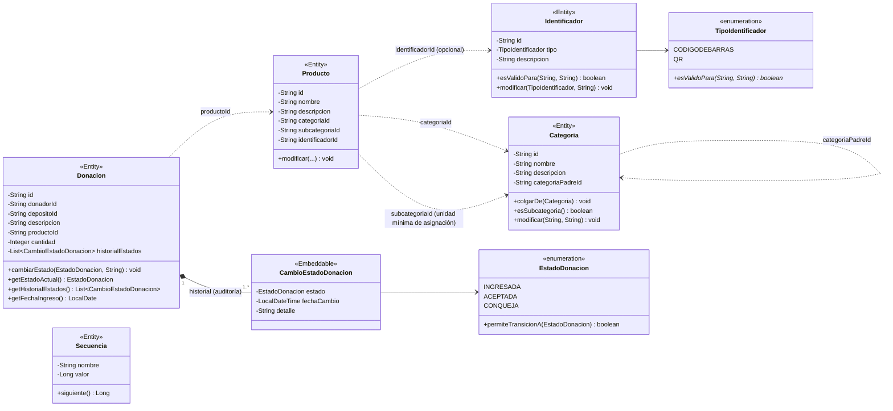

# Diagrama de clases - Servicio de Donaciones

Muestra **solo el dominio** del componente. Los DTOs de la cátedra no aparecen acá: se usan
únicamente como estructuras de intercambio en la fachada y en la API, y se traducen a tipos
propios en los *mappers*, que son la frontera del módulo. Por eso `EstadoDonacion` y
`TipoIdentificador` son enums propios y no los `...Enum` del paquete `catedra.dtos`.

```mermaid
classDiagram
direction LR

class Donacion {
  <<Entity>>
  -String id
  -String donadorId
  -String depositoId
  -String descripcion
  -String productoId
  -Integer cantidad
  -List~CambioEstadoDonacion~ historialEstados
  +cambiarEstado(EstadoDonacion, String) void
  +getEstadoActual() EstadoDonacion
  +getHistorialEstados() List~CambioEstadoDonacion~
  +getFechaIngreso() LocalDate
}

class CambioEstadoDonacion {
  <<Embeddable>>
  -EstadoDonacion estado
  -LocalDateTime fechaCambio
  -String detalle
}

class Producto {
  <<Entity>>
  -String id
  -String nombre
  -String descripcion
  -String categoriaId
  -String subcategoriaId
  -String identificadorId
  +modificar(...) void
}

class Categoria {
  <<Entity>>
  -String id
  -String nombre
  -String descripcion
  -String categoriaPadreId
  +colgarDe(Categoria) void
  +esSubcategoria() boolean
  +modificar(String, String) void
}

class Identificador {
  <<Entity>>
  -String id
  -TipoIdentificador tipo
  -String descripcion
  +esValidoPara(String, String) boolean
  +modificar(TipoIdentificador, String) void
}

class Secuencia {
  <<Entity>>
  -String nombre
  -Long valor
  +siguiente() Long
}

class EstadoDonacion {
  <<enumeration>>
  INGRESADA
  ACEPTADA
  CONQUEJA
  +permiteTransicionA(EstadoDonacion) boolean
}

class TipoIdentificador {
  <<enumeration>>
  CODIGODEBARRAS
  QR
  +esValidoPara(String, String)* boolean
}

Donacion "1" *-- "1..*" CambioEstadoDonacion : historial (auditoría)
CambioEstadoDonacion --> EstadoDonacion
Identificador --> TipoIdentificador
Donacion ..> Producto : productoId
Producto ..> Categoria : categoriaId
Producto ..> Categoria : subcategoriaId (unidad mínima de asignación)
Producto ..> Identificador : identificadorId (opcional)
Categoria ..> Categoria : categoriaPadreId
```

## Decisiones de modelado

**La máquina de estados vive en el enum.** `EstadoDonacion.permiteTransicionA` concentra la regla
(`INGRESADA → ACEPTADA → CONQUEJA`). `Donacion.cambiarEstado` es el **único** camino para mutar el
estado y siempre deja registro en el historial, así que la trazabilidad no se puede saltear. El
getter del historial devuelve una lista inmodificable: la auditoría no se altera desde afuera.

**Los dos tipos de identificador son polimórficos.** Cada constante de `TipoIdentificador`
implementa su propia validación (`CODIGODEBARRAS` exige 3+ palabras en la descripción; `QR` exige
una cantidad par de letras en el nombre), en vez de un `if` sobre el tipo. `Identificador` delega.
Agregar un tipo nuevo es agregar una constante, sin tocar código existente.

**El identificador es opcional.** El enunciado dice que de un producto se conoce su nombre, su
descripción y *opcionalmente* un identificador. Un producto sin código de barras ni QR es válido;
si lo tiene, se valida.

**La subcategoría es la unidad mínima de asignación.** `Categoria` se relaciona consigo misma por
`categoriaPadreId`, lo que permite N subcategorías por categoría (Alimentos → fideos, arroz,
legumbres). `Producto` guarda **ambas**: su categoría y su subcategoría. Al dar de alta un producto
se valida que la subcategoría exista, que sea efectivamente una subcategoría y que pertenezca a la
categoría declarada.

> Limitación conocida: el `ProductoDTO` de la cátedra no tiene campo de subcategoría y el
> `CategoriaDTO` modela una sola subcategoría por categoría. Por eso ese dato viaja por los
> endpoints propios del módulo (`ProductoRequest` / `CategoriaResponse`) y no por los DTOs base,
> que se mantienen intactos.

**Los IDs son numéricos y los asigna este componente.** `Secuencia` es un contador persistido por
tipo de entidad, leído con bloqueo pesimista para que dos requests concurrentes no obtengan el
mismo número. Las entidades conservan un `@PrePersist` con UUID como red de seguridad.

**Encapsulamiento.** Las entidades no exponen `@Setter` de clase: mutar `Producto` o `Categoria`
se hace por métodos de dominio que revalidan las invariantes (cambiar el nombre de un producto
puede invalidar su identificador QR, y eso se chequea). El único setter suelto es el de `id`,
que necesitan los repositorios.
